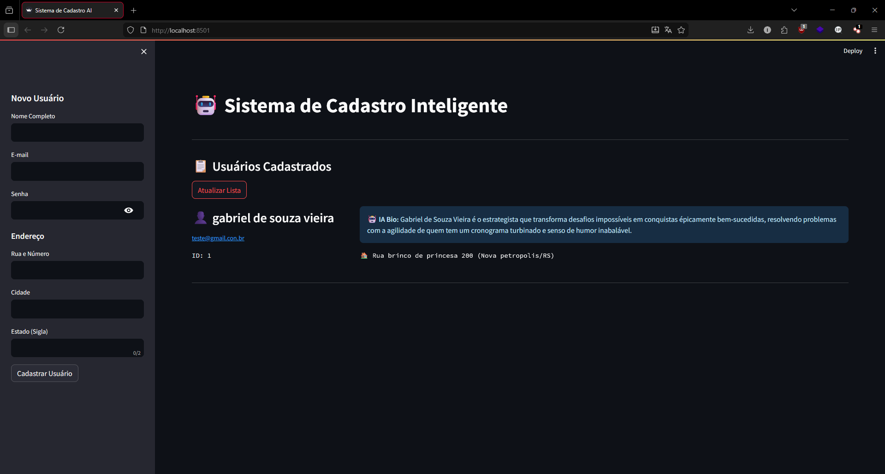

# 🚀 Sistema de Cadastro Inteligente (Full Stack AI)


## 📋 Sobre o Projeto

Este projeto é uma solução **Full Stack** moderna para gerenciamento de usuários. Diferente de um CRUD tradicional, este sistema utiliza **Inteligência Artificial Generativa (Google Gemini 1.5 Flash)** para enriquecer os dados automaticamente: ao cadastrar um usuário, o sistema gera uma "Biografia Profissional" criativa e personalizada em tempo real.

O projeto foi desenhado seguindo as melhores práticas de **DevOps**, rodando 100% isolado em containers **Docker** (Backend + Frontend), garantindo portabilidade e escalabilidade.

---

## 🛠️ Tecnologias & Arquitetura

O sistema é dividido em microsserviços orquestrados via Docker Compose:

### 后端 (Backend API)
* **Framework:** FastAPI (Alta performance e validação automática).
* **Banco de Dados:** SQLAlchemy ORM com SQLite (facilmente escalável para PostgreSQL).
* **Segurança:** Hashing de senhas com **Bcrypt** e gestão de variáveis de ambiente (`.env`).
* **AI Engine:** Integração com Google Gemini API para geração de conteúdo.
* **Testes:** Pytest para testes de integração e regras de negócio.

### 前端 (Interface)
* **Framework:** Streamlit (Python-based UI).
* **Comunicação:** Consome a API RESTful via HTTP Requests.
* **Features:** Formulários interativos e atualização em tempo real.

---

## ✨ Funcionalidades Principais

1.  **🤖 Geração Automática de Bio via IA:**
    * O sistema analisa o nome e dados do usuário.
    * Consulta a API do Google Gemini.
    * Gera e salva uma descrição criativa no banco de dados.
    * *Fallback Seguro:* Se a IA falhar, o cadastro continua sem a bio (Resiliência).

2.  **🐳 Arquitetura Containerizada:**
    * Basta um comando (`docker-compose up`) para subir todo o ambiente (Banco, API e Interface).
    * Zero configuração manual de ambiente na máquina host.

3.  **🛡️ Segurança e Validação:**
    * Prevenção contra e-mails duplicados.
    * Validação rigorosa de tipos de dados (Pydantic).
    * Criptografia de senhas antes da persistência.

---

## 🚀 Como Executar o Projeto

### Pré-requisitos
* [Docker Desktop](https://www.docker.com/products/docker-desktop/) instalado.
* Uma chave de API do Google Gemini (Gratuita no Google AI Studio).

### Passo a Passo

1.  **Clone o repositório:**
    ```bash
    git clone [https://github.com/SEU-USUARIO/NOME-DO-REPO.git](https://github.com/SEU-USUARIO/NOME-DO-REPO.git)
    cd NOME-DO-REPO
    ```

2.  **Configure as Variáveis de Ambiente:**
    Crie um arquivo chamado `.env` na raiz do projeto e adicione sua chave:
    ```ini
    DATABASE_URL=sqlite:///./sistema_cadastro.db
    GEMINI_API_KEY=Cole_Sua_Chave_Aqui
    ```

3.  **Suba a aplicação com Docker:**
    Este comando constrói as imagens e inicia os servidores:
    ```bash
    docker-compose up --build
    ```

4.  **Acesse a Aplicação:**
    * 🖥️ **Frontend (Interface):** Acesse `http://localhost:8501`
    * 📄 **Backend (Documentação Swagger):** Acesse `http://localhost:8000/docs`

---

## 🧪 Executando Testes Automatizados

Para garantir a integridade do código, rode a suíte de testes dentro do container:

```bash
docker-compose exec app pytest
```
Isso validará o fluxo de criação, listagem e tratamento de erros.

## 📸 Demonstração



Fluxo de Cadastro com IA

    Usuário preenche o formulário no Frontend.

    Backend processa, cria o hash da senha e chama o Google Gemini.

    Usuário aparece na lista com a Bio gerada automaticamente.

## 👤 Autor

Gabriel Desenvolvedor Full Stack Python
